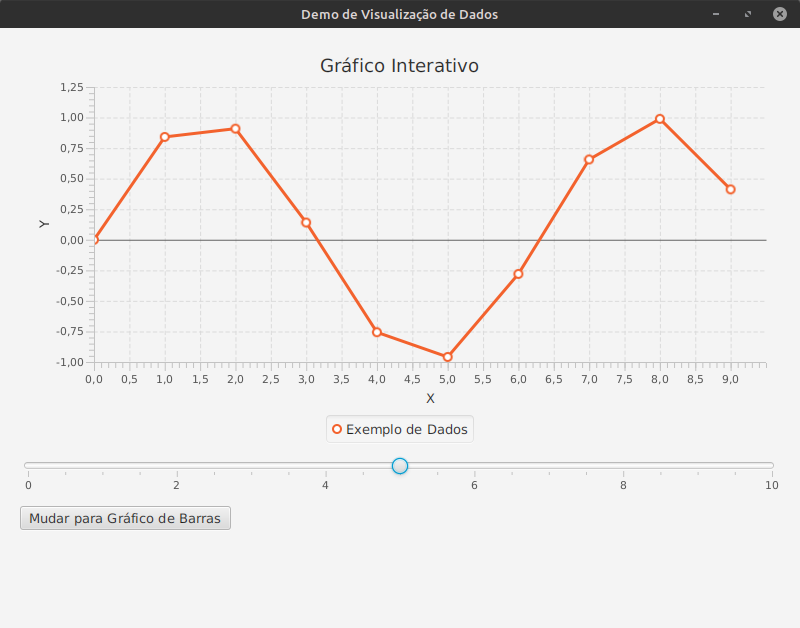
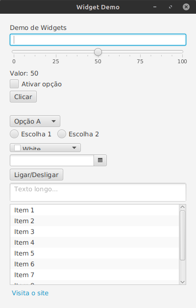
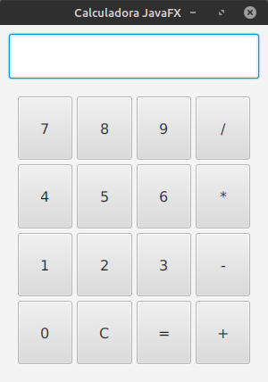
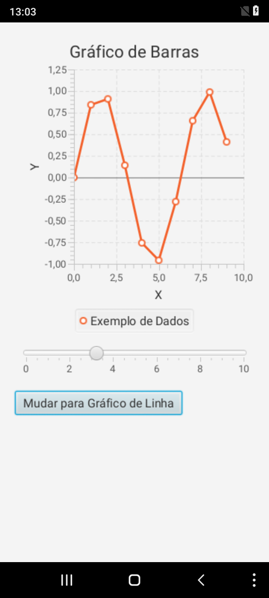
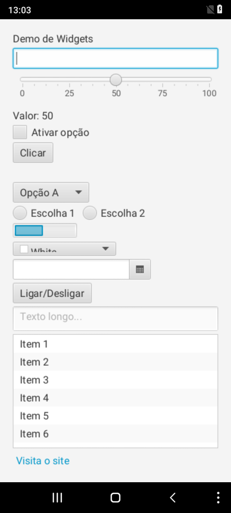
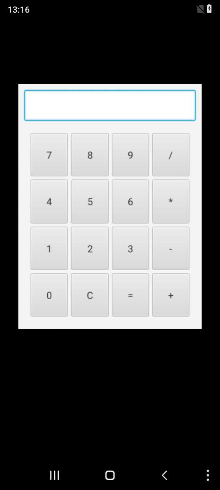

# JavaFX Builder – Android & Desktop

A custom modular JavaFX build system supporting **Desktop** and **Android** deployment without relying on external build tools like Gradle or Maven.

## 🚀 Features

- Compile & run JavaFX apps for Desktop and Android
- No IDE or Gradle required
- Modular Python-based builder
- Automatic APK packaging, signing and installation
- Shared FX runtime (arm32/arm64)
- Support for multiple projects
- Project creator & cleaner
- Scene-based demos included
- 🐳 Docker support for portable and reproducible builds

---

## 📦 Requirements

### Java

- Java JDK 24 is recommended (`jdk-24`)
- Ensure `JAVA_HOME` is set correctly inside the script

### Android SDK & NDK

Install the Android SDK manually or via command line tools:

```bash
cd ~/your/path/
mkdir sdk
cd sdk
wget https://dl.google.com/android/repository/commandlinetools-linux-8512546_latest.zip
unzip commandlinetools-linux-8512546_latest.zip
```

Then configure and install:

```bash
sdk/cmdline-tools/bin/sdkmanager --sdk_root=sdk "platform-tools" "platforms;android-34" "build-tools;34.0.0" 
```

Update the `ANDROID_SDK`  variables in the Python script accordingly.

---

## 📁 Project Structure

Each JavaFX project should follow this layout:

```
MyProject/
├── src/                  # Java source files
│   └── com/example/Main.java
├── res/                  # Android resources (auto-generated if missing)
├── assets/               # Extra files for Android (auto-generated)
├── AndroidManifest.xml   # (optional - generated if missing)
```

---

## 🔧 Build & Run (Local)

### Desktop

```bash
python3 builder.py samples/HelloWorld org.javafxports.helloworld --target desktop
```

### Android

```bash
python3 builder.py samples/HelloWorld org.javafxports.helloworld --target android
```

### Run after build

Add `--run` to execute immediately:

```bash
python3 builder.py samples/HelloWorld org.javafxports.helloworld --target desktop --run
```

---

## 🐳 Docker Support (Cross-platform)

### 1. Pull image

```bash
docker pull luisakadjoker/javafx-builder:latest
```

### 2. Create new project

```bash
docker run -it --rm \
  -v $PWD/samples:/app/samples \
  luisakadjoker/javafx-builder \
  --create com.example.helloworld HelloWorld
```

### 3. Run Desktop app (GUI)

```bash
xhost +local:docker
docker run -it --rm \
  -e DISPLAY=$DISPLAY \
  -v /tmp/.X11-unix:/tmp/.X11-unix \
  -v $PWD/samples:/app/samples \
  luisakadjoker/javafx-builder \
  samples/HelloWorld com.example.helloworld --target desktop --name HelloWorld --run
```

### 4. Run Android app (via ADB)

```bash
docker run -it --rm \
  --privileged \
  --device /dev/bus/usb \
  -v $PWD/samples:/app/samples \
  luisakadjoker/javafx-builder \
  samples/HelloWorld com.example.helloworld --target android --name HelloWorld --run
```

### 5. Clean build folders

```bash
docker run -it --rm \
  -v $PWD/samples:/app/samples \
  luisakadjoker/javafx-builder \
  samples/HelloWorld com.example.helloworld --clean
```

---

## 🆕 Create a New Project (local)

```bash
python3 builder.py com.example.myapp MyApp --create
```

This will generate:

```
MyApp/
├── src/com/example/myapp/MyApp.java
├── AndroidManifest.xml
├── res/ + assets/ prefilled
```

---

## 🧹 Clean a Project

```bash
python3 builder.py samples/HelloWorld org.javafxports.helloworld --clean
```

Removes:
- `/out`
- `/dex`
- `/tmp`
- `/dekstop`
- `.signed.apk`, `.key`

---


## 🖼️ Screenshots

### 💻 Desktop






### 📱 Android






### Demos
- python3 builder.py samples/WidgetDemo com.exemplo.widgetdemo --target desktop --name WidgetDemo --run
- python3 builder.py samples/SceneSwitcher com.exemplo.sceneswitcher --target desktop --name SceneSwitcher --run
- python3 builder.py samples/DataVizDemo com.djokersoft.datavizdemo --target desktop --name DataVizDemo --run
- python3 builder.py samples/calculadora com.djokersoft.calculadora --target desktop --name Calculadora --run

## 📌 Notes

- The JavaFX runtime and native libs are expected under `androidFX/`
- Shared `.so` files and default `res/` files are included
- The Android launcher uses `javafxports.android.FXActivity`

---

##  GitHub & DockerHub

- GitHub: [github.com/akadjoker](https://github.com/akadjoker)
- DockerHub: [hub.docker.com/u/luisakadjoker](https://hub.docker.com/u/luisakadjoker)

---

## 📋 License

MIT License – free to use, adapt and share.

Created by DjokerSoft.